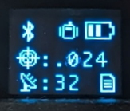
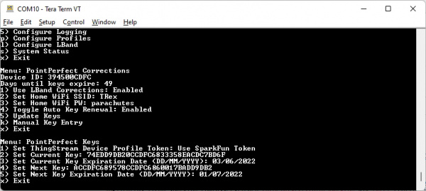

# PointPerfect Menu

Torch:  

*Configuring PointPerfect settings over serial*

*PointPerfect Coverage map including L-Band and IP delivery methods*

SparkFun RTK devices are equipped to get corrections from a service called PointPerfect. 

PointPerfect has the following benefits and challenges:

* Most SparkFun RTK devices come with either a pre-paid subscription or one month of free access to PointPerfect. Please see the product details for your device.
* A SparkFun RTK device can obtain RTK Fix anywhere there is [coverage](https://www.u-blox.com/en/pointperfect-service-coverage). This includes the US contiguous 48 states, the EU, Korea, as well as parts of Australia, Brazil, and Canada. Note: L-Band coverage is not available in some of these areas.
* You don't need to be near a base station - the PPP-RTK model covers entire continents.
* Because PointPerfect uses a model instead of a dedicated base station, it is cheaper. However, the RTK Fix is not as accurate (3-6cm) as compared to getting corrections from a dedicated base station (2cm or better but depends on the baseline distance).
* Because PointPerfect uses a model instead of a dedicated base station, convergence times (the time to get to RTK Fix) can vary widely. Expect to wait multiple minutes for an RTK Fix, as opposed to corrections from a dedicated that can provide an RTK Fix in seconds.

PointPerfect corrections are obtained by two methods:

* **L-Band**: Corrections are transmitted from a geosynchronous satellite. Coverage areas are limited to the US contiguous 48 states and the EU. This delivery method requires special equipment (see the [RTK Facet L-Band](https://www.sparkfun.com/products/20000) for more information). No cellular or internet connection is required.

* **IP**: Corrections are transmitted over the internet. The RTK device will need access to a WiFi network. This is most commonly a hotspot on a cell phone so this delivery method is generally confined to areas with cellular and/or WiFi coverage.

## Keys

To gain access to the PointPerfect system, the device must be given WiFi. Once provided, the RTK device will automatically obtain **keys**. These keys allow the decryption of corrections.

PointPerfect keys are valid for a maximum of 56 days. During that time, the RTK device can operate normally without the need for WiFi access. However, when the keys are set to expire in 28 days or less, the RTK Facet L-Band will attempt to log in to WiFi at each power on. If WiFi is not available, it will continue normal operation. If the keys fully expire, the device will continue to receive the L-Band signal but will be unable to decrypt the signal, disabling high-precision GNSS. The RTK Facet L-Band will continue to have extraordinary accuracy (we've seen better than 0.15m HPA) but not the centimeter-level accuracy that comes with RTK.

**Note:** The RTK Facet L-Band is capable of receiving RTCM corrections over traditional means including NTRIP data over Bluetooth or a serial radio. But the real point of L-Band and PointPerfect is that you can be *anywhere*, without cellular or radio cover, and still enjoy millimeter accuracy.

*Display showing 14 days until keys expire*

The unit will display various messages to aid the user in obtaining keys as needed.

*Three pronged satellite dish indicating L-Band reception*

Upon successful reception and decryption of PointPerfect corrections, the satellite dish icon will increase to a three-pronged icon. As the unit's fix increases the cross-hair will indicate a basic 3D solution, a double blinking cross-hair will indicate a floating RTK solution, and a solid double cross-hair will indicate a fixed RTK solution.

*PointPerfect Menu*

The *Days until keys expire* inform the user how many days the unit has until it needs to connect to WiFi to obtain new keys.

* Option '1' disables the use of PointPerfect corrections.

* Option '2' disables the automatic attempts at WiFi connections when key expiry is less than 28 days.

* Option '3' will trigger an immediate attempt to connect over WiFi and update the keys.

* Option '4' will display the Device ID. This is needed when a SparkFun RTK Facet L-Band product needs to be added to the PointPerfect system. This is normally taken care of when you purchase the L-Band unit with PointPerfect service added, but for customers who wish to extend their subscription beyond the initial year, or did not purchase the service and want to add it at a later date, this Device ID is what customer service needs.

* Option 'k' will bring up the Manual Key Entry menu.

*Manual Key Entry Menu*

Because of the length and complexity of the keys, we do not recommend you manually enter them. This menu is most helpful for displaying the current keys.

Option '1' will allow a user to enter their Device Profile Token. This is the token that is used to provision a device on a PointPerfect account. By default, users may use the SparkFun token but must pay SparkFun for the annual service fee. If an organization would like to administer its own devices, the token can be changed here.

