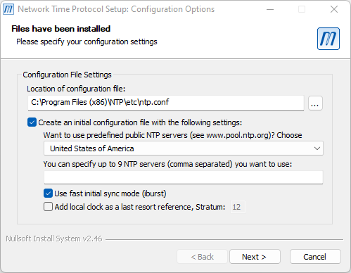
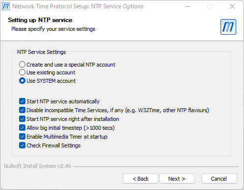
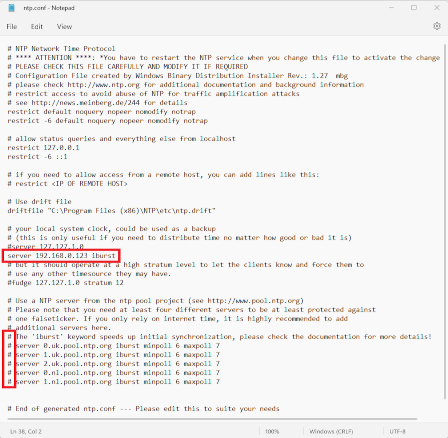
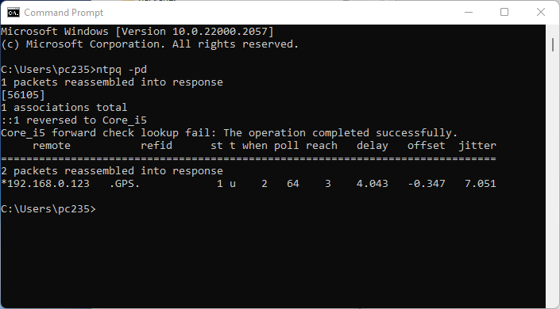

# Network Time Protocol (NTP)

Surveyor:  / Express:  / Express Plus:  / Facet:  / Facet L-Band:  / Reference Station: 

The Reference Station can act as an Ethernet Network Time Protocol (NTP) server.

Network Time Protocol has been around since 1985. It is a simple way for computers to synchronize their clocks with each other, allowing the network latency (delay) to be subtracted:

* A client sends a NTP request (packet) to the chosen or designated server
    * The request contains the client's current clock time - for identification

* The server logs the time the client's request arrived and then sends a reply containing:
    * The client's clock time - for identification
    * The server's clock time - when the request arrived at the server
    * The server's clock time - when the reply is sent
    * The time the server's clock was last synchronized - providing the age of the synchronization

* The client logs the time the reply is received - using its own clock

When the client receives the reply, it can deduce the total round-trip delay which is the sum of:

* How long the request took to reach the server

* How long the server took to construct the reply

* How long the reply took to reach the client

This exchange is repeated typically five times, before the client synchronizes its clock to the server's clock, subtracting the latency (delay) introduced by the network.

Having your own NTP server on your network allows tighter clock synchronization as the network latency is minimized.

The Reference Station can be placed into its dedicated NTP mode, by pressing the **MODE** button until NTP is highlighted in the display and pausing there.

*Selecting NTP mode*

The Reference Station will first synchronize its Real Time Clock (RTC) using the very accurate time provided by the u-blox GNSS module. The module's Time Pulse (Pulse-Per-Second) signal is connect to the ESP32 as an interrupt. The ESP32's RTC is synchronized to Universal Time Coordinate (UTC) on the rising edge of the TP signal using the time contained in the UBX-TIM-TP message.

The WIZnet W5500 interrupt signal is also connected to the ESP32, allowing the ESP32 to accurately log when each NTP request arrives.

The Reference Station will respond to each NTP request within a few 10's of milliseconds.

If desired, you can log all NTP requests to a file on the microSD card, and/or print them as diagnostic messages. The log and messages contain the NTP timing information and the IP Address and port of the Client.

*System Debug Menu - NTP Diagnostics (Click for a closer look)*

*Logging Menu - Log NTP Requests*

### Logged NTP Requests

*Logged NTP Requests*

NTP uses its own epoch - midnight January 1st 1900. This is different to the standard Unix epoch - midnight January 1st 1970 - and the GPS epoch - midnight January 6th 1980. The times shown in the log and diagnostic messages use the NTP epoch. You can use online calculators to convert between the different epochs:

* [https://weirdo.cloud/](https://weirdo.cloud/)

* [https://www.unixtimestamp.com/](https://www.unixtimestamp.com/)

* [https://www.labsat.co.uk/index.php/en/gps-time-calculator](https://www.labsat.co.uk/index.php/en/gps-time-calculator)

### NTP on Windows

If you want to synchronise your Windows PC to a Reference Station NTP Server, here's how to do it:

* Install [Meinberg NTP](https://www.meinbergglobal.com/english/sw/ntp.htm) - this replaces the Windows built-in Time Service

    * During the install, select "Create an initial configuration file" and select the NTP Pool server for your location
    * Select "Use fast initial sync mode" for faster first synchronisation

* The next step is to edit the NTP Configuration File
    * Editing the file requires Administrator privileges
    * Open the *Start* menu, navigate to *Meinberg*, right-click on *Edit NTP Configuration* and select *Run as administrator*

    * Comment the lines in *ntp.conf* which name the pool.ntp servers
    * Add an extra *server* line and include the IP Address for your Reference Station. It helps to give your Reference Station a fixed IP Address first - see [Menu Ethernet](menu_ethernet.md)
    * Save the file

* Finally, restart the NTP Service
    * Again this needs to be performed with Administrator privileges
    * Open the *Start* menu, navigate to *Meinberg*, right-click on *Restart NTP Service* and select *Open file loctaion*

    * Right-click on the *Restart NTP Service* and select *Run as administrator*

* You can check if your PC clock synchronised successfully by opening a *Command Prompt (cmd)* and running *ntpq -pd*

If enabled, your Windows PC NTP requests will be printed and logged by the reference station. See [above](#logged-ntp-requests).

