# Disassembly / Repair

Surveyor:  / Express:  / Express Plus:  / Facet:  / Facet L-Band: 

The RTK product line is fully open-source hardware. This allows users to view schematics, code, and repair manuals. This section documents how to safely disassemble the RTK Facet. 

Tools Needed:

* [Small Philips Head Screwdriver](https://www.sparkfun.com/products/9146)
* [Curved Tweezers](https://www.sparkfun.com/products/10602)
* [U.FL Puller](https://www.sparkfun.com/products/20687) - *Recommended*
* [Wire Cutters](https://www.sparkfun.com/products/10447) - *Recommended*

## Opening Facet

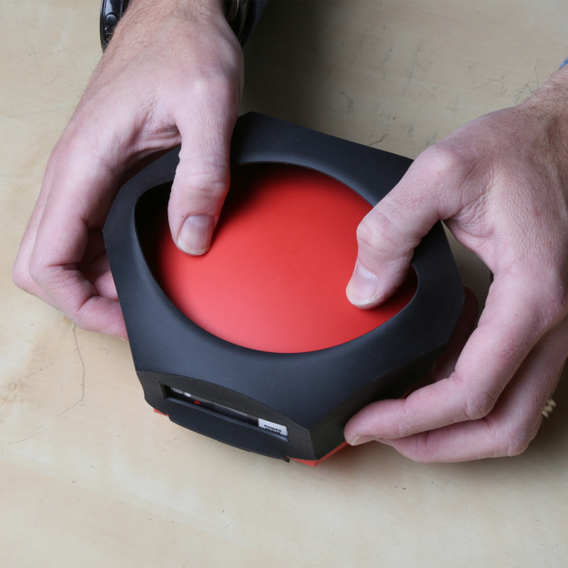

Starting from the back of the unit, remove the protective silicone boot. If your boot has gotten particularly dirty from field use, rinse it with warm water and soap to clean it up.

Remove the four Philips head screws. They may not come all the way out of the lower enclosure.

The top lid should then come off. The front overlay is adhesive and may adhere slightly to the 'tooth' on the lid. You will not damage anything by gently prying it loose from the lid as you lift the lid.

**Tip:** The lid makes a great screw bin.

Note the antenna orientation so that it can be re-mounted in the same way. A sharpie dot towards the display is a handy method. 

Remove the four screws holding the antenna in place. 

Be aware that the antenna material is susceptible to fingerprints. You won't likely damage the reception but it's best to just avoid touching the elements.

The antenna will be attached to the main board and must stay that way for the next few steps. Without pulling on the thin RF cable, gently set the antenna to the side.

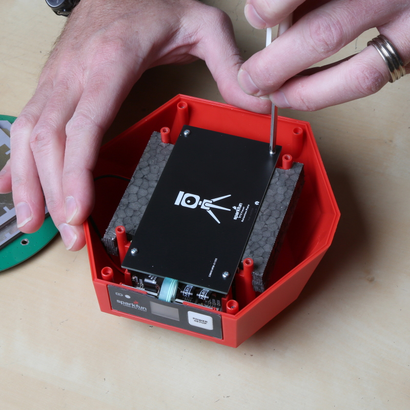

The battery and vertical PCBs are held in place using a retention PCB. Remove the four screws holding the PCB in place and lift off the foam top of the battery holder. 

**Note:** v1.0 of the retention plate is not symmetrical. Meaning, if the plate is installed in reverse, the retention PCB will be just short of the connector board and will not properly hold it in place. Reinstall the retention plate as shown in the picture.

**Note:** The foam is held to the PCB using an adhesive. Some of that adhesive is exposed to catch material that may enter into the enclosure. Try to avoid getting stuck.

Set the retention PCB to the side.

## Removing Antenna Connection

This is the most dangerous step. The cable connecting the antenna to the main board uses something called a U.FL or IPEX connector. These tend to be fragile. You can damage the connector rendering the unit inoperable. Just be sure to take your time.

Using the U.FL removal tool, slide the tool onto the U.FL connector and gently pull away from the main board. If it won't give, you may need to angle the tool slightly while pulling.

**Note:** If you do not have a U.FL tool this [tutorial on U.FL connectors](https://learn.sparkfun.com/tutorials/three-quick-tips-about-using-ufl/all#disconnect) has three alternative methods using tweezers, wire cutters, and a skinny PCB that may also work. 

The U.FL connector will disconnect. The antenna can now be set to the side.

## Opening Backflip Connectors

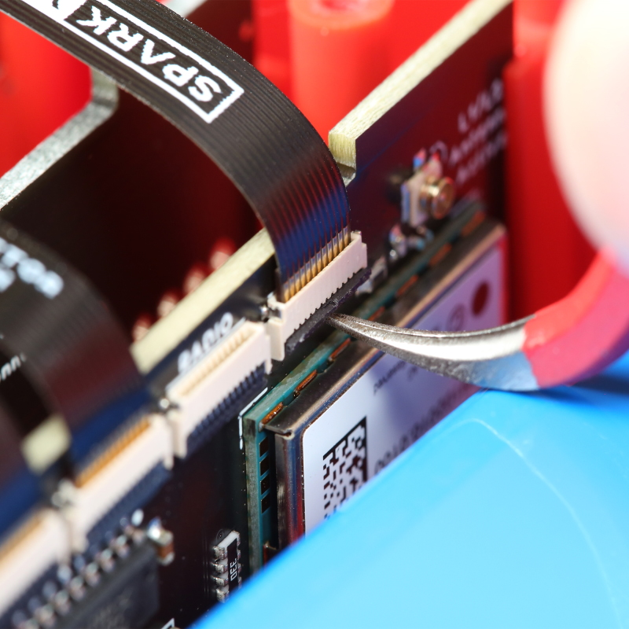

Many of the connections made within the RTK product line use this 'back flip' style of FPC connector. To open the connector and release the flex printed circuit (FPC) cable, use a curved pair of tweezers to gently flip up the arm. The arm in the connector above has been flipped, the FPC can now be removed.

As shown above, remove the FPC connecting to the 4th connector on the main board. The connector is labeled 'SD Display'. Leave all other FPCs in place.

The main board is attached to the battery and the connector board. Lift the mainboard and connector board together, bringing the battery with the assembly.

## Removing the Battery

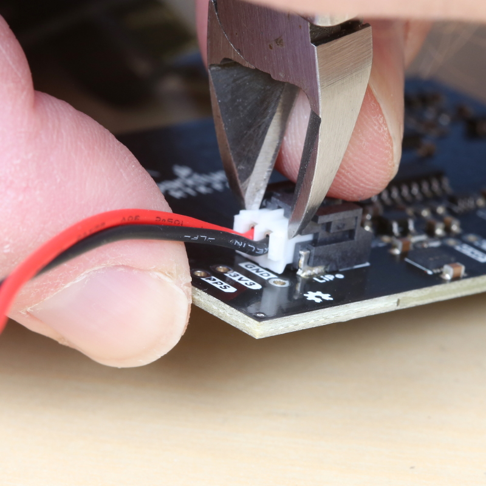

**Note:** This step is not needed for general repair. Only disconnect the battery if you are replacing the battery.

The battery is plugged into the mainboard using a JST connector. These are very strong connectors. *Do not* pull on the wires. We recommend using the mouth of wire cutters (also known as diagonal cutters) to pry the connector sideways. 

Once removed, the battery can be set aside.

## Removing the Front Overlay

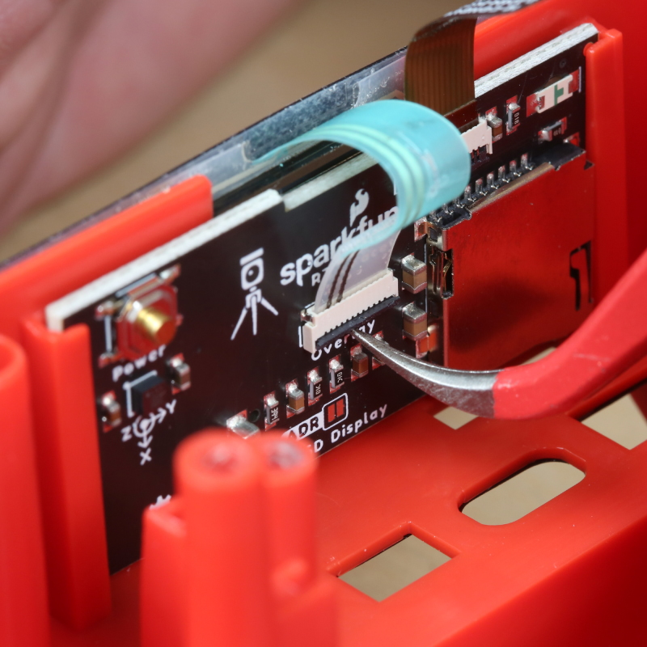

The front overlay (the sticker with the Power button) is connected to the display board using the same style 'back flip' FPC connector. Flip up the arm and disconnect the overlay.

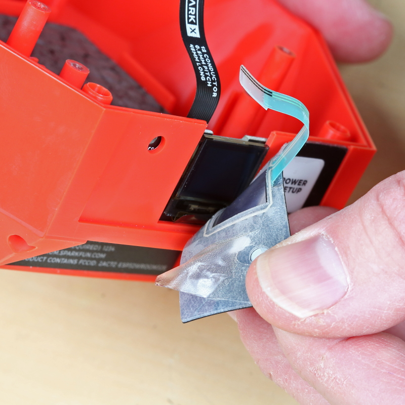

Gently peel off the adhesive overlay from the front face. This cannot be saved.

## Inserting New Display Board

Slide the old display board out. Remove the brown FPC from the old display board and move over to the new display board. Insert the new display board into the slot.

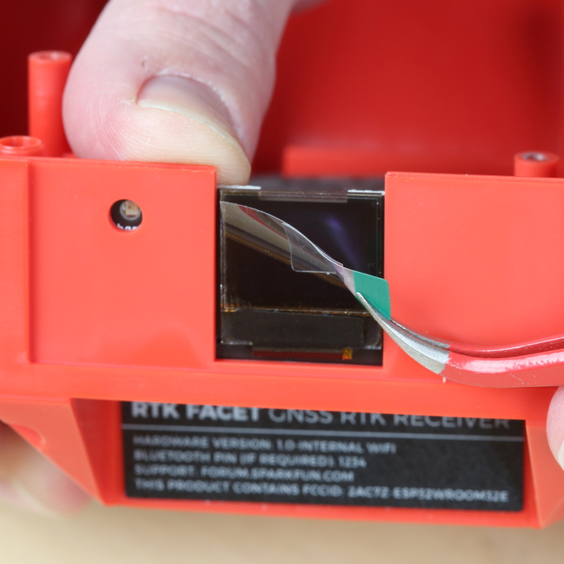

With the new display board in place, remove the protective film from the display.

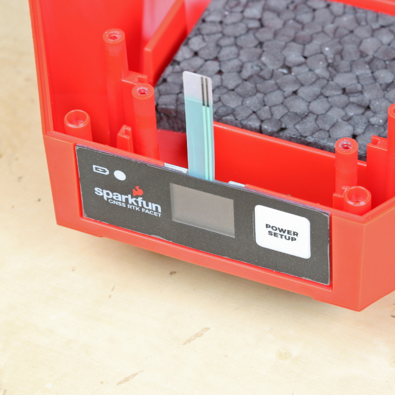

Remove the backing from the new overlay. Stick the overlay into the center of the front face area.

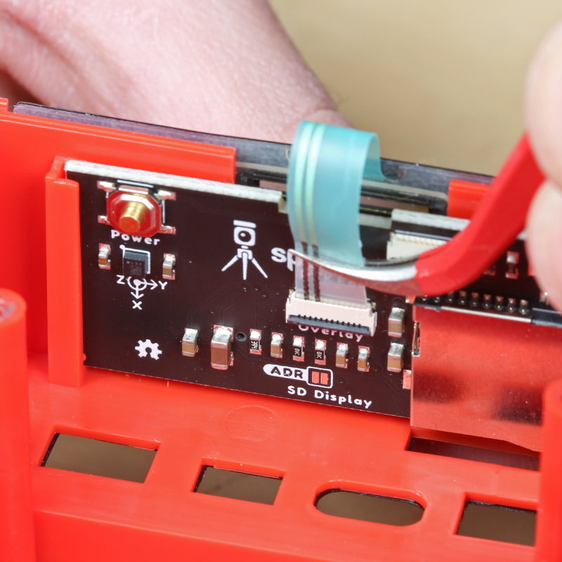

Be sure to flip up the arm on the overlay connector before trying to insert the new overlay FPC.

Using tweezers, and holding the FPC by the cable stiffener, insert the overlay FPC into the display board. 

## Closing The Backflip Connector

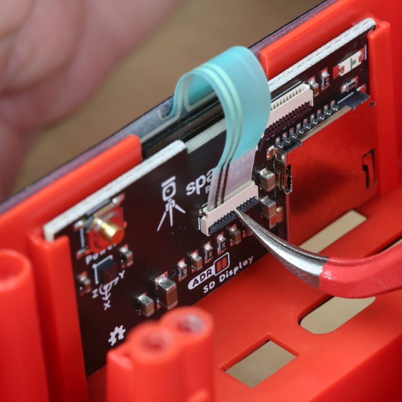

Use the nose of the tweezers to press the arm down, securing the FPC in place.

If you haven't already done so, move the brown FPC from the original display board over to the new display board. Be sure to open the connector before inserting the FPC, and then press down on the arm to secure it in place.

## Reinstalling Main Board

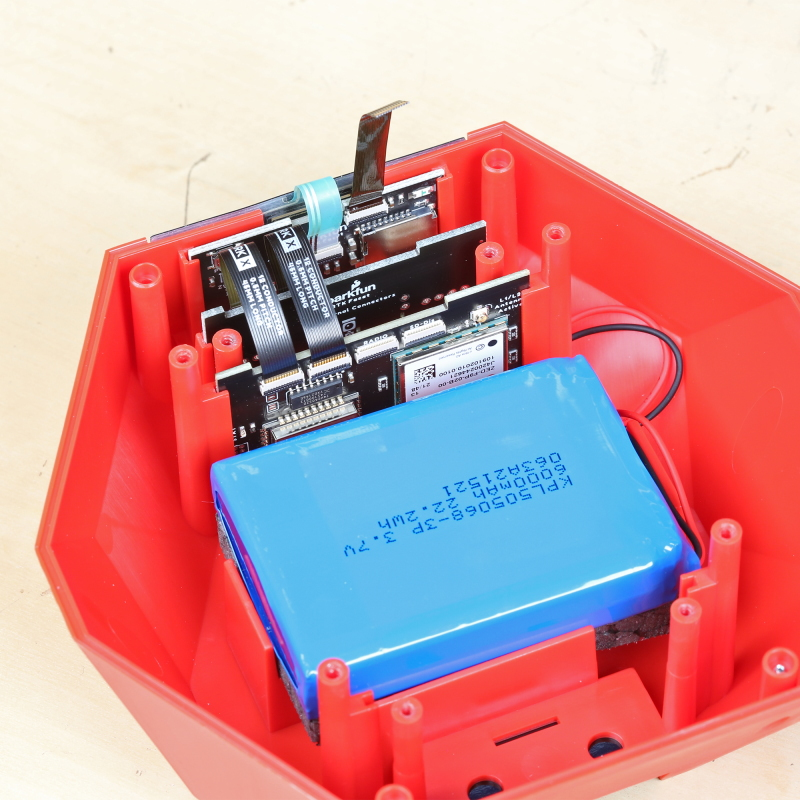

Slide the main board and connector boards back into place along with the battery. We find it easier to partially insert the connector board, then the main board, and then adjust them down together.

Reconnect the display board to the main board. Be sure to close the arm on the main board to secure the FPC in place. 

## Testing the Overlay

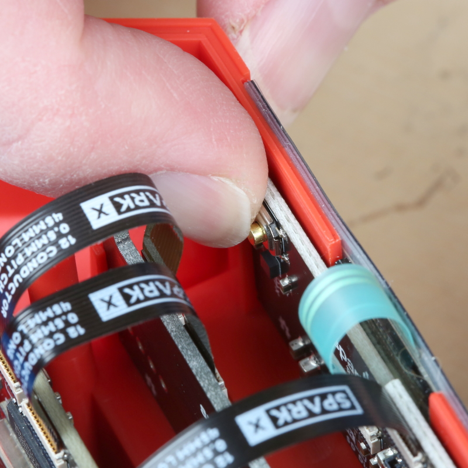

The RTK Facet has two power buttons: the external button on the overlay and an internal button on the back of the display board (shown above). Pressing and holding the internal button will verify the connection between the display board and the main board.

If the internal button is not working, remove and reinsert the FPC connecting the display board to the main board.

Press and hold the internal power button to power down the unit.

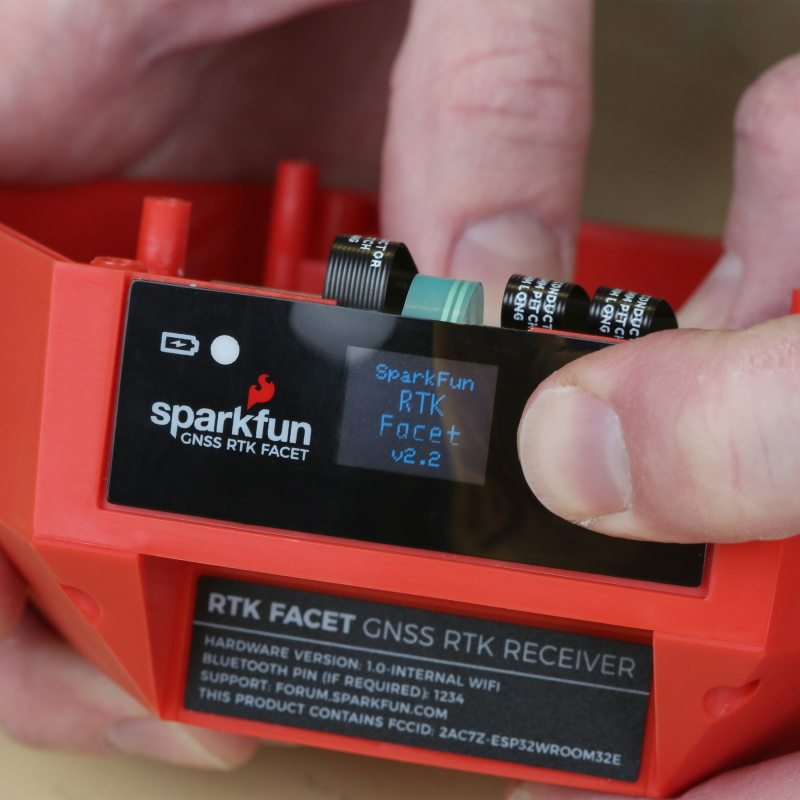

Repeat the process using the overlay button to verify the external power button is working. 

If the external overlay button is not working, but the internal button is, remove and reinsert the FPC connecting the overlay to the display board.

If the external button is working, proceed with re-assembling the unit.

## Reassembly

Confirm that all FPC armatures are in the down and locked position.

Carefully line the U.FL connector up with the main board and gently press the connector in place. A tool is useful in this step but an index finger works just as reliably.

Place the retention plate and foam over the battery. The battery may need to be nudged slightly to align with the upper cavity.

**Note:** v1.0 of the retention plate is not symmetrical. Meaning, if the plate is installed in reverse, the retention PCB will be just short of the connector board and will not properly hold it in place. Reinstall the retention plate as shown in the picture above.

Secure the retention plate with the four *small* screws.

Place the antenna over top of the retention plate in the same orientation as it was removed. Secure in place with the four *large* screws.

Plate the dome over the antenna with the front 'tooth' aligning over the display.

Secure the dome in place using four *small* screws.

Replace the silicone boot around the device.

Power on the RTK Facet and take outside to confirm SIV reaches above ~20 satellites and HPA is below ~1.0m.